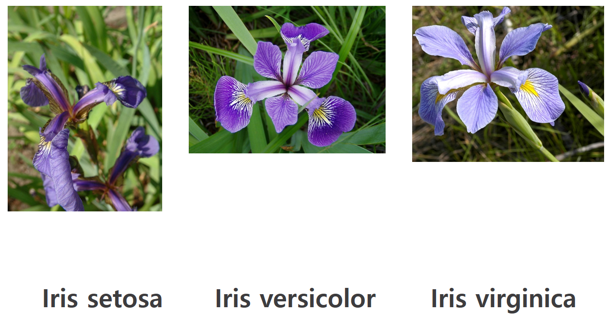
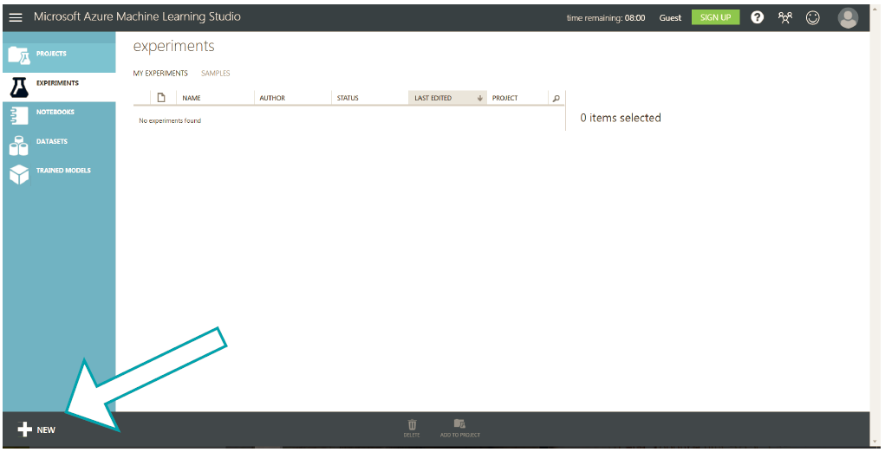
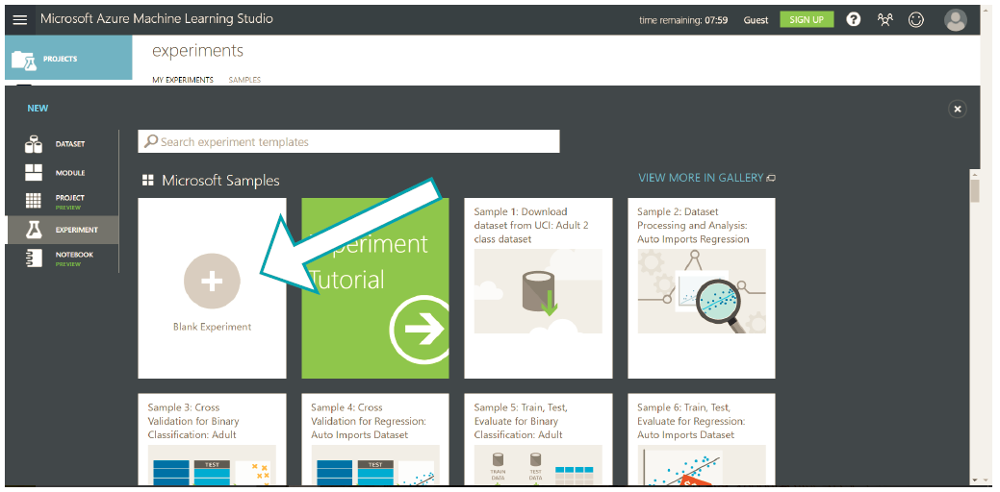
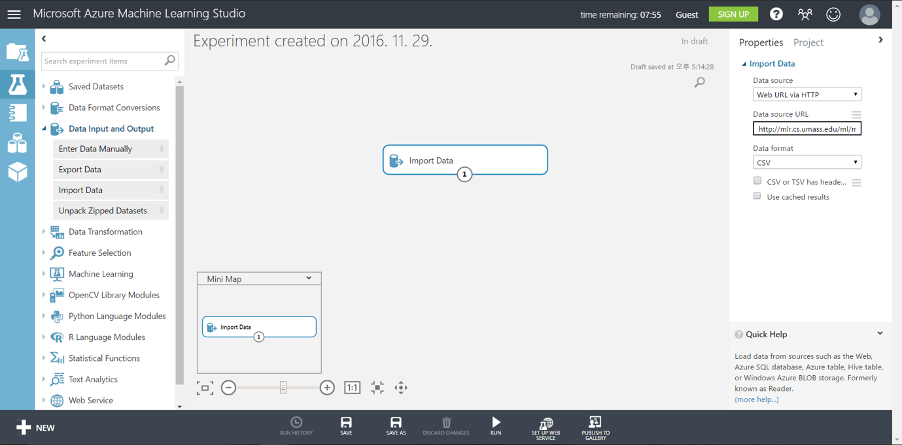
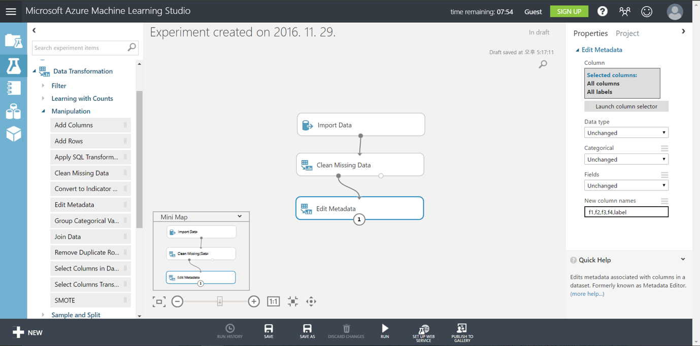
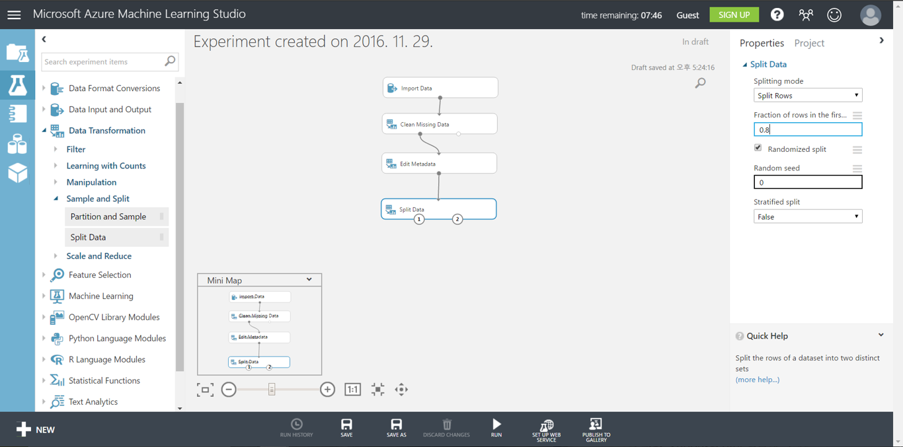
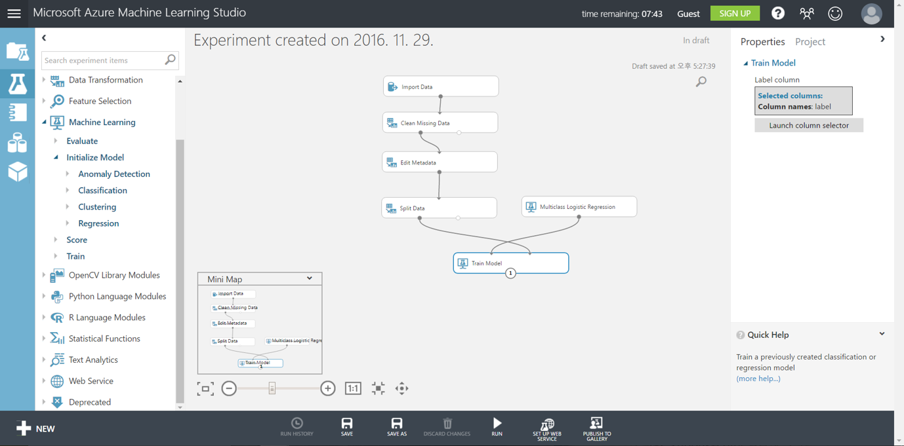
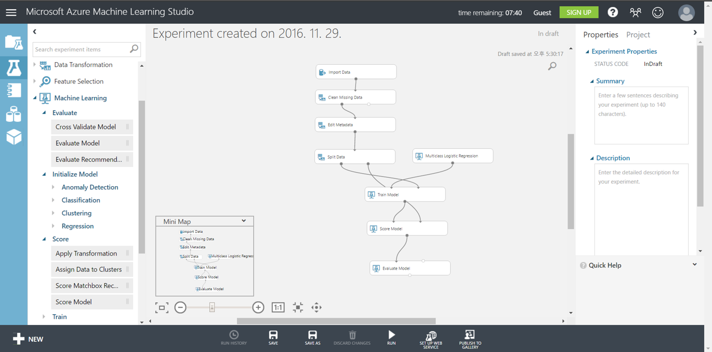
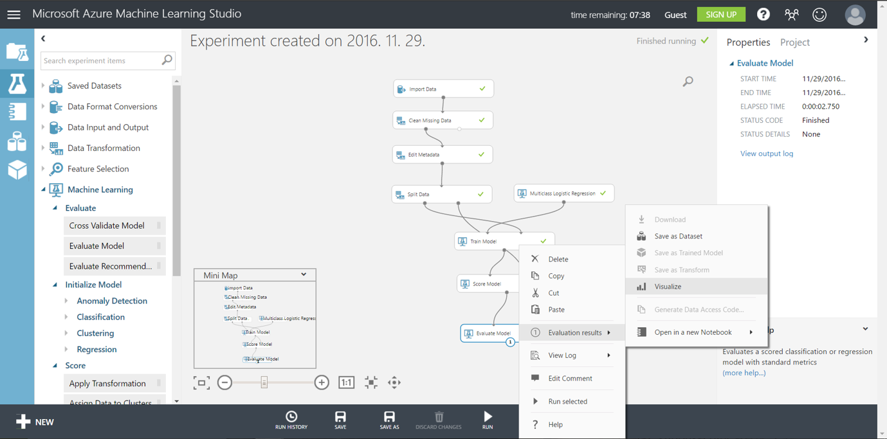
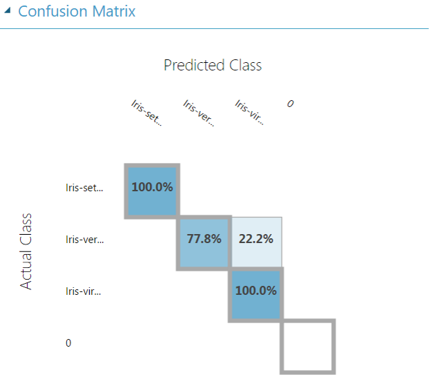

# Azure ML Studio 소개
Microsoft에서 제공하는 ML 솔루션 클라우드 입니다. 드래그&드롭 방식으로 쉽게 사용하실 수 있습니다. 
Supervised / Unsupervised Learning 를 지원합니다. 

## 실습해 볼 예제 소개
붓꽃의 특성값을 이용해 종 분류하는 실습을 해 볼 예정입니다. 데이터의 구성은 다음과 같습니다. 
1) 꽃받침의 길이 2) 꽃받침의 너비 3) 꽃잎의 길이 4) 꽃잎의 너비

## Step 1 - Azure ML Studio 접속
* Azureml.com 접속

* 8-hour trial 선택

## Step 2 - 실험 생성
* 왼쪽 아래의 + new 버튼 클릭

* Blank Experiment

## Step 3 - 데이터 로딩
* 왼쪽의 Data Input and Output 에서 Import data 모듈 드래그

* Data source : Web URL via HTTP
* URL : http://mlr.cs.umass.edu/ml/machine-learning-databases/iris/iris.data

## Step 4 - 데이터 전처리 
* 왼쪽의 Data Transformation / Manipulation에서Clean Missing Data, Edit Metadata 모듈 드래그

* Edit Metadata의 Launch column selector를 클릭한 후 All columns, All labels 선택
* New column names : f1,f2,f3,f4,label

## Step 5 - 학습용 데이터와 검증용 데이터 구분
* 왼쪽의 Data Transformation / Sample and Split에서 Split data 모듈 드래그
* Fraction 0.8으로 설정

## Step 6 - Model 생성
* 왼쪽의 Machine Learning / Train에서 Train Model 모듈 드래그, Machine Learning / Initialize Model / Classification에서 Multiclass Logistic Regression 모듈 드래그 후 연결

* Train Model의 launch column selector를 누르고 column names에 label 입력

## Step 7 - Model 평가
* 왼쪽의 Machine Learning / Score 에서 Score Model 모듈 드래그, Machine Learning / Evaluate에서 Evaluate Model 모듈 드래그 후 연결

* Train Model의 launch column selector를 누르고 column names에 label 입력

## Step 8 - 실행

