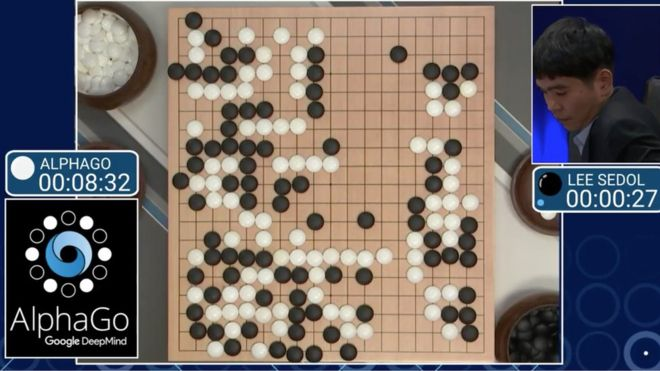
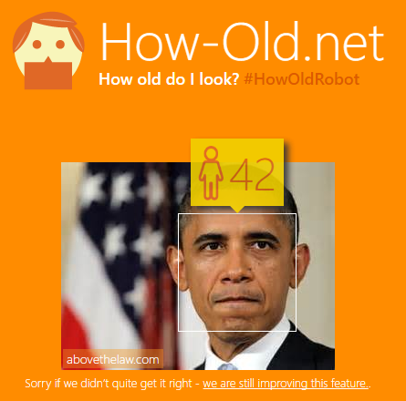
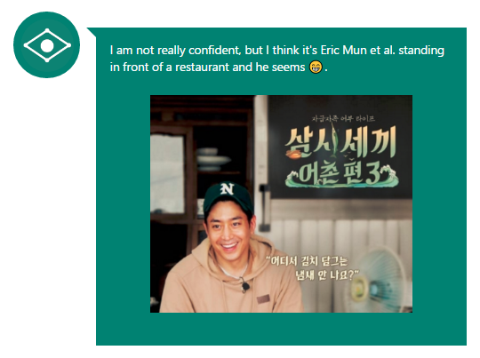
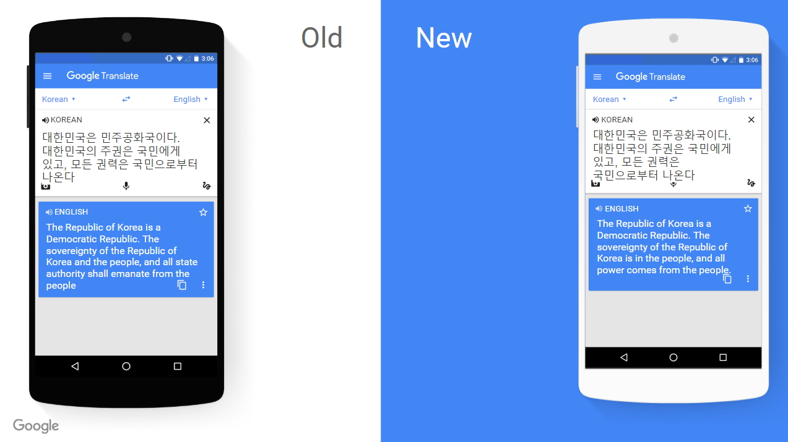

## 머신러닝이란 무엇인가?
Machine Learning, 즉 기계를 학습 시켜서 인간의 삶을 좀 더 풍요롭게(?) 만들어보고자 하는 학문인가요? 
넵! 그렇다고 볼 수 있습니다. 풀기 어려운 문제에 대해 컴퓨터가 학습하여 해결할 수 있도록, 컴퓨터를 학습시키는 방법에 관한 학문입니다. 
또한, 컴퓨터를 학습시키기 위해서는 풀어야할 문제와 관련된 데이터가 필요합니다. 데이터를 통해 컴퓨터가 학습할 수 있도록 하려면, 그와 관련된 알고리즘도 필요합니다. 따라서, 데이터를 통해 학습하는 알고리즘에 관한 학문이기도 합니다. 

## 머신러닝, 왜 핫한가?
실제로 머신러닝 기술은 여러 분야에서 다양하게 사용되고 있습니다. 
대표적으로 구글의 알파고를 떠올려 볼 수 있습니다. (긴 설명은 필요 없겠죠?)

이 뿐만이 아닙니다! 마이크로소프트도 Cognitive Services 라는 것을 발표했는데 (사람들이 잘 모르는게 함정...)  이 또한 머신러닝 기술을 이용하여 개발된 것입니다.
살펴보시면 재미난 서비스들이 많은데요, 내가 몇살인지 맞추는 How-Old.net 이라는 서비스와, 사진을 업로드하면 사진에 대한 재미난 설명을 달아주는 Captionbot.ai 라는 서비스도 있습니다. 당장 테스트 고고!!

[how-Old.net](http://how-old.net/)에서 버락 오바마 사진을 테스트 해본 결과 42라네요! 핫! 

[Captionbot.ai](https://www.captionbot.ai/) 에서 사진을 업로드해보니 에릭인지 맞추네요? 신기해라~ 

우리아이가 달라졌어요를 방불케하는 유명 검색엔진들의 번역 서비스 성능 향상에도 머신러닝 기술이 크게 작용을 했다고 합니다. 

구글 번역기에 GNMT라는 신경망 기계번역 기술이 도입되어 번역의 퀄리티가 더욱 업그레이드 되었다고 합니다. 

## 머신러닝, 어떻게 사용할 수 있는가?
머신러닝 기술에서 기계를 학습시키는 방법은 크게 세가지로 구분됩니다. 정답을 알려주고 학습을 시키는 지도학습(Supervised Learning), 서로 비슷한 것 끼리 분류하며 학습하는 비지도 학습(Unsupervised Learning), 마지막으로 시행착오를 겪으며 어떤 행동에 대에 보상을 받는 방식으로 학습해나가는 강화학습(Reinforcement Learing)이 있습니다. 

* 지도학습 : Label된 데이터를 통해 훈련, Regression, Classification 주로 사용
* 비지도 학습 : Label이 없는 데이터를 통해 훈련, Clustering, Dimensionality reduction 주로 사용
* 강화학습 : (상태, 행동)에 대한 보상으로 훈련, Markov Decision Process 주로 사용

이 세가지 학습 방법은 상호 보완적인 관계입니다. 해결하고 싶은 문제가 있으신 경우 학습 방법을 적절히 섞어서 이용하실 수도 있습니다. 

마이크로소프트도 머신러닝과 관련된 기술과 제품을 가지고 있습니다. Azure ML Studio를 이용하여 지도학습과, 비지도 학습을 아주아주 쉽고 간편하게 실습해보실 수 있습니다. 또한, 구글의 텐서플로우 처럼 마이크로소프트 리서치 팀이 만든 CNTK 라는 오픈소스 딥러닝 툴킷도 있습니다! 

* [Azure ML Studio](https://azure.microsoft.com/ko-kr/services/machine-learning/)
* [마이크로소프트의 오픈소스 딥러닝 툴킷 - CNTK](https://github.com/Microsoft/CNTK) 